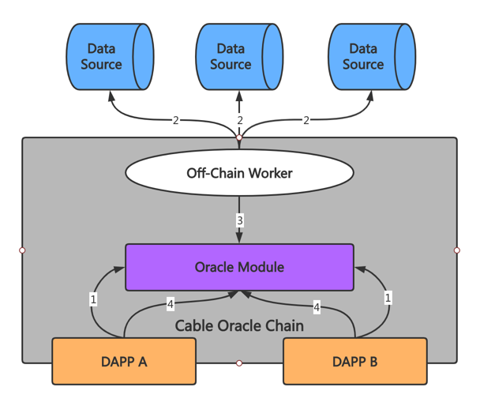

# Cable Oracle Chain

## Overview
  
1. DAPPs query off-chain price data.  
2. Off-chain workers fetch off-chain price data from data source.  
3. Off-chain workers submit off-chain price data to the blockchain.  
4. DAPPs get price data from oracle module.

## Getting Started


### Rust Setup

First, complete the [basic Rust setup instructions](./doc/rust-setup.md).

### Run

Use Rust's native `cargo` command to build and launch the template node:

```sh
cargo run --release -- --dev --tmp
```

### Build

The `cargo run` command will perform an initial build. Use the following command to build the node
without launching it:

```sh
cargo build --release
```

### Embedded Docs

Once the project has been built, the following command can be used to explore all parameters and
subcommands:

```sh
./target/release/node-template -h
```

## Run

The provided `cargo run` command will launch a temporary node and its state will be discarded after
you terminate the process. After the project has been built, there are other ways to launch the
node.

### Single-Node Development Chain

This command will start the single-node development chain with persistent state:

```bash
./target/release/node-template --dev
```

Purge the development chain's state:

```bash
./target/release/node-template purge-chain --dev
```

Start the development chain with detailed logging:

```bash
RUST_LOG=debug RUST_BACKTRACE=1 ./target/release/node-template -lruntime=debug --dev
```

### Multi-Node Local Testnet

If you want to see the multi-node consensus algorithm in action, refer to
[our Start a Private Network tutorial](https://substrate.dev/docs/en/tutorials/start-a-private-network/).

